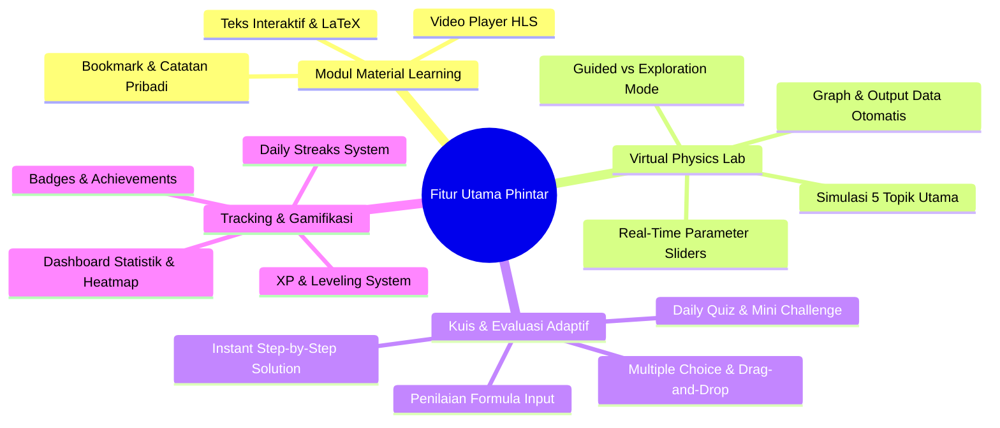
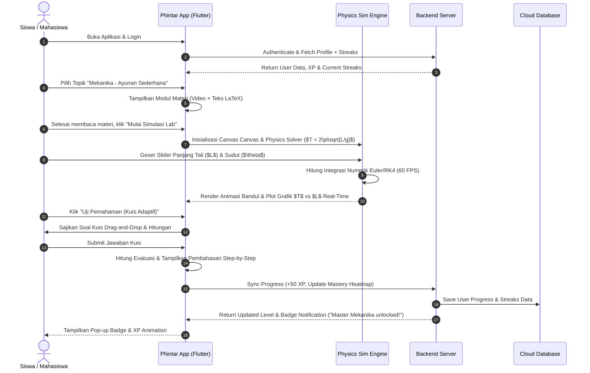
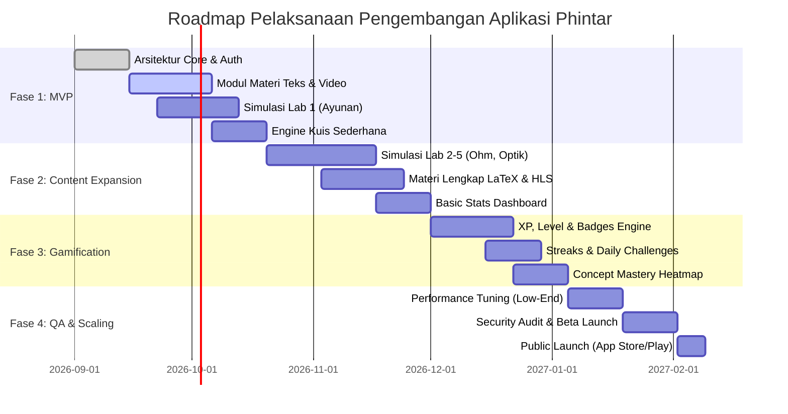

# Rencana Pengembangan Komprehensif Aplikasi Belajar Fisika Mandiri "Phintar"

Dokumen ini menyajikan rencana pengembangan sistematis dan komprehensif untuk aplikasi **Phintar** — platform pembelajaran fisika mandiri interaktif berbasis multimedia, laboratorium virtual real-time, dan gamifikasi.

---

## 1. Ringkasan Eksekutif & Visi Produk

### 1.1 Visi Produk
Menjadi platform pembelajaran fisika interaktif nomor 1 di Indonesia yang mentransformasi pemahaman fisika dari sekadar "hafalan rumus abstrak" menjadi **pengalaman visual, intuitif, dan eksperimental**. Phintar memungkinkan siswa SMA dan mahasiswa tingkat awal memahami prinsip-prinsip fisika secara mandiri melalui simulasi laboratorium virtual real-time dan umpan balik langsung.

### 1.2 Problematika Utama & Solusi
| Problematika Pembelajaran Fisika | Solusi Aplikasi Phintar |
| :--- | :--- |
| **Abstraksi Konsep**: Konsep fisika (gelombang, medan listrik, vektor) sulit dibayangkan tanpa media visual. | **Modul Multimedia Interaktif**: Diagram interaktif, rumus terformat LaTeX/MathML, dan video konsep singkat. |
| **Keterbatasan Lab Fisik**: Sekolah/kampus seringkali memiliki keterbatasan alat praktikum fisika. | **Virtual Lab Real-Time**: Simulasi fisika 2D/3D berbasis parameter dinamis dengan pengolahan grafik real-time. |
| **Rasa Jenuh & Kurang Rutinitas**: Belajar mandiri sering terhenti karena kurangnya motivasi dan umpan balik. | **Sistem Gamifikasi & Analitik**: Streaks harian, XP/Badges ("Master Mekanika"), serta dashboard penguasaan konsep. |

---

## 2. Functional & Non-Functional Requirements

### 2.1 Functional Requirements (FR)



1. **Modul Material Learning (Teks & Video)**
   - **FR-ML-01**: Render teks interaktif dengan penulisan rumus fisika presisi tinggi (LaTeX/MathML support) dan highlight istilah penting.
   - **FR-ML-02**: Integration video streaming (HLS/MP4) dengan fitur kontrol kecepatan playback, pemotongan bab video (*video chapters*), dan transkrip interaktif.
   - **FR-ML-03**: Fitur penanda (*bookmark*) halaman dan pembuatan catatan pribadi (*private notes*) per topik.

2. **Laboratorium Virtual Interaktif (Virtual Lab)**
   - **FR-VL-01**: Menyediakan 5 modul eksperimen simulasi utama:
     1. *Ayunan Sederhana & Pendulum* (Mekanika)
     2. *Hukum Ohm & Rangkaian Listrik* (Listrik Magnet)
     3. *Optik & Pembiasan Lensa/Cermin* (Optika)
     4. *Gerak Parabola & Kinematika* (Mekanika)
     5. *Gelombang & Interferensi Celah Ganda* (Gelombang)
   - **FR-VL-02**: Kontrol variabel dinamis real-time (sliders & input angka) seperti massa ($m$), panjang tali ($L$), tegangan ($V$), resistansi ($R$), sudut ($\theta$), dan percepatan gravitasi ($g$).
   - **FR-VL-03**: Generating grafik hubungan variabel dinamis (misal: grafik $T^2$ vs $L$ atau $I$ vs $V$) secara langsung (*live plot*) saat simulasi berjalan.
   - **FR-VL-04**: 2 Mode Eksperimen: **Guided Mode** (Langkah praktikum terstruktur dengan instruksi tugas) dan **Free Exploration Sandbox** (Eksplorasi bebas tanpa batasan variabel).

3. **Sistem Kuis & Evaluasi**
   - **FR-QS-01**: Kuis Adaptif per modul (Multiple Choice, Drag-and-Drop Diagram komponen fisika, dan evaluasi isian variabel/rumus).
   - **FR-QS-02**: Instant Feedback & Step-by-Step Solution: Menampilkan analisis pembuktian rumus dan visualisasi kesalahan langkah kerja siswa secara mendalam.
   - **FR-QS-03**: Daily Quiz & Mini Challenge untuk memberikan *reward XP* harian dan menjaga rutinitas belajar.

4. **Tracking Progres Belajar & Gamifikasi**
   - **FR-GM-01**: Dashboard Analitik: Grafik persentase penyelesaian modul, total durasi belajar, performa kuis per bab, dan *Concept Mastery Heatmap*.
   - **FR-GM-02**: Gamifikasi XP & Level: Kenaikan level pengguna berdasarkan aktivitas belajar dan skor kuis.
   - **FR-GM-03**: Badge Prestasi: Penghargaan visual dinamis (contoh: "Master Mekanika", "Eksplorer Optik", "Pakar Hukum Ohm").
   - **FR-GM-04**: Daily Streaks System dengan kalender presensinya untuk membangun *habit formation*.

---

### 2.2 Non-Functional Requirements (NFR)

- **NFR-PERF-01 (Frame Rate Simulasi)**: Simulasi Virtual Lab wajib berjalan di minimal **60 FPS** pada peranti kelas menengah (*mid-range mobile devices*) dan minimal **30+ FPS** pada peranti kelas bawah (*entry-level devices*).
- **NFR-PERF-02 (Latency & Load Time)**: Response time REST API backend < **200ms**, dan inisialisasi simulasi lab < **1.5 detik**.
- **NFR-OFF-01 (Offline-First Capability)**: Pengguna dapat membaca materi teks, membuat catatan, dan mengerjakan kuis dasar tanpa koneksi internet (menggunakan sinkronisasi database lokal SQLite).
- **NFR-SEC-01 (Keamanan Data)**: Autentikasi menggunakan standar OAuth2 / JWT, enkripsi data sensitif pengguna (TLS 1.3 saat transit dan AES-256 saat tersimpan di DB).
- **NFR-USAB-01 (Aksesibilitas & UI)**: Memenuhi standar WCAG 2.1 AA, responsif di berbagai ukuran layar (smartphone 5" hingga tablet 11" portrait & landscape).

---

## 3. User Journey & Alur Pengguna (User Flow)

### 3.1 User Journey Map



---

## 4. Design System & UI/UX Guidelines

### 4.1 Visual Hierarchy & Design System Tokens

Aplikasi Phintar mengusung pendekatan visual **Friendly, Modern, Dynamic & Scientific** dengan kombinasi elemen *Glassmorphism* dan warna aksen fisikis yang kontras.

```
+-----------------------------------------------------------------------+
|                              COLOR PALETTE                            |
+-------------------+--------------------+------------------+-----------+
| Phintar Blue      | Energy Amber       | Quantum Purple   | Dark Slate|
| #2A64F6           | #FF9F1C            | #7C3AED          | #0F172A   |
| (Primary Theme)   | (XP, Streaks, Acc) | (Interactive Lab)| (Canvas)  |
+-------------------+--------------------+------------------+-----------+
```

1. **Color Tokens**:
   - **Primary**: `Phintar Blue (#2A64F6)` — Memberikan kesan profesional, percaya diri, dan saintifik.
   - **Secondary / Accent**: `Energy Amber (#FF9F1C)` — Digunakan untuk elemen gamifikasi (XP, Streaks, Bintang Prestasi).
   - **Lab Interactive Elements**: `Quantum Purple (#7C3AED)` & `Neon Teal (#06B6D4)` — Warna variabel slider, node rangkaian listrik, dan vektor gaya.
   - **Background & Canvas**:
     - *Light Mode*: Background `#F8FAFC`, Surface `#FFFFFF`, Border `#E2E8F0`.
     - *Dark Mode*: Background `#0F172A`, Surface `#1E293B`, Physics Canvas `#090D16`.

2. **Typography**:
   - **Primary Font**: `Plus Jakarta Sans` / `Inter` (Google Fonts) untuk teks antarmuka yang bersih dan mudah dibaca pada layar kecil.
   - **Math & Formula Font**: `KaTeX` / `Computer Modern` / `Roboto Mono` untuk perumusan matematika fisika.

3. **Micro-Interactions & Feedback Visual**:
   - **Shimmer Animation**: Efek pemuatanSkeleton loading saat data materi/video diambil.
   - **Physics Haptic & Animation**: Respons getaran (*haptics*) saat menyentuh slider lab atau menghubungkan komponen kabel pada simulasi Hukum Ohm.
   - **Gamification Celebrations**: Animasi Lottie perayaan (confetti + badge pop-up) saat menyelesaikan kuis atau mencapai streak harian.

---

## 5. Rekomendasi Tech Stack & Arsitektur Sistem

### 5.1 Arsitektur Sistem High-Level

```mermaid
graph TD
    subgraph Client Layer (Cross-Platform)
        MobileApp[Flutter Mobile App - iOS & Android]
        WebApp[Flutter Web App / Progressive Web App]
    end

    subgraph Simulation Layer (Client Engine)
        CustomPainter[Flutter CustomPainter Engine]
        PhysicsSolver[Custom Physics Math Solver RK4]
        ChartEngine[fl_chart Real-Time Renderer]
    end

    subgraph API Gateway & Service Layer
        APIGateway[REST API Gateway / NestJS / Node.js]
        AuthService[Auth Service - JWT / OAuth2]
        QuizEngine[Adaptive Quiz & Grading Engine]
        ProgressService[Analytics & Gamification Service]
    end

    subgraph Storage & Infrastructure
        PrimaryDB[(PostgreSQL - User, Progress, Quizzes)]
        LocalDB[(SQLite / sqflite - Offline Cache)]
        RedisCache[(Redis - Leaderboard & Session Cache)]
        MediaCDN[Cloudflare CDN + AWS S3 - HLS Videos & Assets]
    end

    MobileApp --> CustomPainter
    MobileApp --> LocalDB
    CustomPainter --> PhysicsSolver
    CustomPainter --> ChartEngine
    
    MobileApp <-->|HTTPS / TLS 1.3| APIGateway
    APIGateway --> AuthService
    APIGateway --> QuizEngine
    APIGateway --> ProgressService
    
    ProgressService --> PrimaryDB
    ProgressService --> RedisCache
    APIGateway ..-> MediaCDN
```

---

### 5.2 Komponen Technical Stack Detail

| Layer | Teknologi Direkomendasikan | Alasan Pemilihan & Justifikasi Arsitektur |
| :--- | :--- | :--- |
| **Frontend Framework** | **Flutter (Dart 3.x)** | **Single Codebase** untuk Android, iOS, dan Web. Kinerja kompilasi native (AOT) sangat tinggi, serta dukungan rendering `CustomPainter` dan Canvas API yang optimal untuk simulasi interaktif tanpa kebergantungan pada WebView. |
| **Simulasi Virtual Lab Engine** | **Flutter CustomPainter + Custom RK4 Solver** *(opsional: `Forge2D` / `Flame`)* | Untuk simulasi fisika 2D (gerak parabola, pendulum, optik), `CustomPainter` dengan persamaan diferensial numerik *Runge-Kutta 4th Order (RK4)* memberikan presisi tinggi pada 60 FPS tanpa beban memory tinggi. |
| **Graphing Engine** | **`fl_chart` / `syncfusion_flutter_charts`** | Library render grafik berkinerja tinggi yang mendukung perbaruan data dinamis real-time (live stream 60 FPS) tanpa me-rebuild seluruh layar UI. |
| **Local Database (Offline-First)** | **`sqflite` + `shared_preferences`** | Menyimpan materi teks, progres kuis, dan data lokal secara offline. Data akan disinkronkan secara otomatis ketika perangkat terhubung kembali ke internet. |
| **Backend API** | **Node.js (NestJS)** atau **Go (Fiber)** / **Supabase** | NestJS menyediakan arsitektur modular enterprise (TypeScript), mempermudah pembuatan REST API untuk manajemen user, adaptif kuis, dan tracking progres. |
| **Database Utama** | **PostgreSQL** | Database relasional robust untuk menyimpan data pengguna, struktur bab materi, relasi kuis, riwayat nilai, dan kriteria rincian badges. |
| **Caching & Real-Time Data** | **Redis** | Digunakan untuk caching leaderboard harian/mingguan, tracking aktif sesi user, dan *rate-limiting*. |
| **Media Storage & CDN** | **AWS S3 / Cloudflare R2 + Cloudflare CDN** | Menyimpan aset video edukasi berbasis format **HLS (HTTP Live Streaming)** agar adaptive streaming dapat berjalan lancar di koneksi lambat. |

---

## 6. Roadmap Pelaksanaan & Strategi Testing

### 6.1 Roadmap Peluncuran Produk (4 Fase Utama)



#### Rincian Deliverables per Fase:

- **Fase 1: MVP (Minimum Viable Product) – Durasi: 8 Minggu**
  - Autentikasi Pengguna (Email, Password, OAuth Google).
  - Modul Materi Teks & Video untuk 2 Bab Utama (*Mekanika: Gerak Parabola & Ayunan Sederhana*).
  - 1 Simulasi Virtual Lab Dasar (Ayunan Sederhana dengan parameter massa & panjang tali).
  - Sistem Kuis Pilihan Ganda Sederhana dengan Instant Feedback.
  - Implementasi database lokal (`sqflite`) untuk offline reading.

- **Fase 2: Pengayaan Konten & Fitur Lab – Durasi: 6 Minggu**
  - Pengembangan 4 Simulasi Lab Tambahan (*Hukum Ohm, Optik/Lensa, Kinematika, Gelombang & Interferensi*).
  - Integrasi Live Plotting Grafik Real-Time ($I$ vs $V$, $T^2$ vs $L$).
  - Fitur Mode Terstruktur (Guided Experiment) dan Mode Bebas (Free Sandbox).
  - Dukungan Video HLS Streaming dengan kualitas adaptif.

- **Fase 3: Gamifikasi & Progres Analitik – Durasi: 6 Minggu**
  - Implementasi Engine XP, Leveling, dan sistem pencapaian Badge ("Master Mekanika", "Eksplorer Optik").
  - System Tracker Streaks Harian/Mingguan lengkap dengan Push Notification pengingat.
  - Interactive Analytics Dashboard: Grafik waktu belajar, akurasi kuis, dan *Concept Mastery Heatmap*.

- **Fase 4: Pengujian, Optimasi & Scaling – Durasi: 4 Minggu**
  - Optimasi memori & garansi 60 FPS simulasi lab pada perangkat Android low-end (RAM 2GB/3GB).
  - Audit Keamanan (Penetration Testing REST API & JWT security).
  - Pengujian Aksesibilitas & Beta Testing bersama 100+ siswa/mahasiswa.
  - Peluncuran Publik di Google Play Store & Apple App Store.

---

### 6.2 Strategi Pengujian & Kualitas (Testing Strategy)

1. **Unit Testing & Mathematical Solver Validation**:
   - Melakukan pengujian unit pada persamaan matematika simulasi fisika (misal: verifikasi presisi nilai periode $T = 2\pi\sqrt{\frac{L}{g}}$ dengan toleransi error $< 0.01\%$).
   - Pengujian State Management (Bloc / Riverpod unit test) untuk memastikan kestabilan aliran data kuis dan progres user.

2. **Simulation Performance & Benchmark Testing**:
   - Menjalankan pengujian FPS dan konsumsi CPU/RAM menggunakan Flutter DevTools pada berbagai spesifikasi perangkat.
   - Memastikan tidak ada *memory leak* pada saat perpergantian layar simulasi lab (*Dispose Canvas Controllers*).

3. **Usability & UX Testing**:
   - Uji coba kemudahan manipulasi slider dan pemahaman grafik oleh pengguna sasaran (Siswa SMA/Mahasiswa).
   - Pengujian skenario offline-to-online data synchronization.

---

## 7. Kesimpulan & Langkah Selanjutnya

Rencana pengembangan aplikasi **Phintar** ini dirancang secara terstruktur untuk menjawab tantangan pembelajaran fisika mandiri melalui fondasi teknologi yang fleksibel, scalable, dan berperforma tinggi.

> [!IMPORTANT]
> **Rekomendasi Tindakan Selanjutnya**:
> 1. Tinjau dan konfirmasi rancangan spesifikasi fitur & tech stack di atas.
> 2. Lanjutkan ke pembuat skema database PostgreSQL & struktur arsitektur widget Flutter di codebase.
